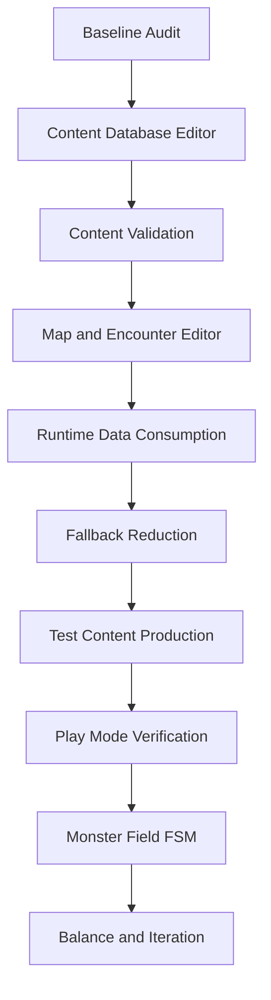
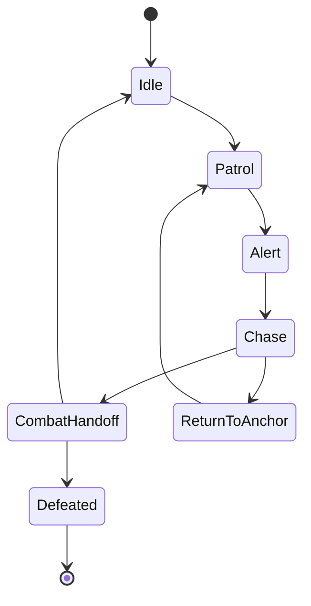

# Editor Tool and Content Production Pipeline Plan

This document defines the production pipeline for moving the project from a
hardcoded runtime prototype toward an editor-authored, validated content workflow.

The immediate goal is not to remove every fallback. The goal is to build a reliable
authoring path first, prove it through validation, then reduce fallback catalog usage
only where the database path is already verified.

## Operating Rule

Every implementation task in this area must update the checklist in this document.

Required workflow for every task:

1. Mark the target checklist item as `In Progress` before implementation.
2. Keep the scope small enough that validation can prove the change.
3. Add or update validation for the new contract.
4. Run the relevant batch validation.
5. Mark the checklist item as `Done` only after validation passes.
6. If work is intentionally deferred, add a short note under `Deferred Notes`.

Status labels:

- `[ ]` Not started
- `[~]` In progress
- `[x]` Done
- `[!]` Blocked or needs design decision

## Pipeline Overview



## Core Principles

- Runtime reads `ContentDatabase.asset` first. Maps can be consumed either as
  generated runtime maps from a validated `RuntimeMapGenerationBundle` plus seed
  or as saved `CompiledMapAsset` fixtures for fixed/debug/test content.
- C# catalog fallback remains until the database route is validated.
- Editor tools must support authoring, saving, validation, and runtime verification.
- Current direct database editing is a bootstrap bridge, not the final Unity
  authoring model.
- Final editor UX should be Inspector-first and asset-first. Use typed
  ScriptableObject authoring assets, prefab/FBX/material references, custom
  inspectors, Scene View tools, and build/validation windows.
- Editor-only code must stay out of Runtime/Core assemblies.
- Runtime/Core/UI Runtime must not reference `UnityEditor`, `EditorWindow`, `AssetDatabase`, `MenuItem`, or `Conn.Editor`.
- Test content should be produced only after the relevant editor and validation path exists.
- Monster field AI/FSM should come after map, encounter, and placement contracts are stable.

Architecture reference:

- [`editor/inspector_first_editor_architecture.md`](editor/inspector_first_editor_architecture.md)

## Phase 0: Baseline Audit

Purpose: make the current state explicit before expanding tools.

Deliverables:

- Runtime database consumption table
- fallback catalog inventory
- hardcoded scene/NPC/service path inventory
- current validation entry points

Checklist:

- [x] Create `doc/dev/data_pipeline_status.md`.
- [x] List all Runtime DB-first paths.
- [x] List all remaining C# catalog fallback paths.
- [x] List hardcoded scene generation paths in `P0SceneBuilder`.
- [x] List hardcoded NPC/service interaction paths.
- [x] Confirm Chapter 1 batch validation passes.
- [x] Confirm Chapter 2 batch validation passes.
- [x] Confirm Runtime/Core/UI Runtime forbidden Editor reference scan passes.

Completion gate:

- The team can answer which systems are DB-authored, fallback-backed, or still hardcoded.

## Phase 1: Content Database Editor

Purpose: make core game content editable inside Unity.

Editor target:

```text
Content Database Window
├─ Asset Selector / Create Database
├─ Quest Tab
├─ Monster Tab
├─ Encounter Tab
├─ NPC Tab
├─ Skill Tab
├─ Vendor Tab
└─ Validation Tab
```

### 1.1 Shared Editor Shell

Checklist:

- [x] Add stable tab navigation to `ContentDatabaseWindow`.
- [x] Add active `ContentDatabaseDefinition` selector.
- [x] Add create/save controls.
- [x] Add dirty-state handling.
- [x] Add validation run button.
- [x] Add validation result panel with errors and warnings.
- [x] Ensure Editor code stays inside `Conn.Editor`.

Completion gate:

- A designer can select a database asset, edit data, save, and see validation results.

### 1.2 Monster Editor

Fields:

- `Id`
- `DisplayName`
- `MaxHp`
- `AttackPower`
- `Defense`
- `XpReward`
- `Boss`
- `Ai`

Checklist:

- [x] Add monster list view.
- [x] Add monster detail editor.
- [x] Add create/delete monster.
- [x] Validate id uniqueness.
- [x] Validate positive HP.
- [x] Validate positive attack power.
- [x] Validate non-negative XP reward.
- [x] Confirm RuntimeContentDatabase can read editor-authored monsters.

Completion gate:

- A new monster created in the editor can be used by an encounter and loaded by Runtime.

### 1.3 Encounter Editor

Fields:

- `Id`
- `DisplayName`
- `MonsterId`
- `Pattern`
- `EnemySlots`
- `XpReward`
- `RewardId`
- future `RewardTableId`

Checklist:

- [x] Add encounter list view.
- [x] Add encounter detail editor.
- [x] Add primary monster selector.
- [x] Add enemy slot list editor.
- [x] Add slot id/count/primary controls.
- [x] Validate primary monster exists.
- [x] Validate enemy slot monster references.
- [x] Validate duplicate slot ids.
- [x] Validate pattern is not empty.
- [x] Confirm CombatRuntimeService preserves pattern/reward/slots.

Completion gate:

- A new DB-authored encounter can be selected by a quest and starts combat through Runtime.

### 1.4 Quest Editor

Fields:

- `Id`
- `DisplayName`
- `Description`
- `TargetMonsterId`
- `TargetEncounterId`
- `MapKind`
- `MapProfileId`
- `GoldReward`
- `XpReward`
- `RewardItems`

Checklist:

- [x] Add quest list view.
- [x] Add quest detail editor.
- [x] Add target monster selector.
- [x] Add target encounter selector.
- [x] Add map profile id field.
- [x] Add reward item list editor.
- [x] Validate quest target monster exists.
- [x] Validate quest target encounter exists.
- [x] Validate quest target monster matches encounter primary monster.
- [x] Validate map profile id is present.
- [x] Confirm Quest Board uses editor-authored quest.

Completion gate:

- A new DB-authored quest appears on the quest board and links to combat.

### 1.5 NPC Editor

Fields:

- `Id`
- `DisplayName`
- `Description`
- `ServiceType`
- `VendorId`
- `QuestIds`

Checklist:

- [x] Add NPC authoring asset browser/build bridge.
- [x] Add NPC detail authoring fields.
- [x] Add service type field or selector.
- [x] Add vendor selector.
- [x] Add quest/quest seed list editor.
- [x] Validate vendor reference.
- [x] Treat `quest_seed_` ids as NPC seed namespace.
- [x] Warn on unknown non-seed quest ids.
- [x] Confirm Runtime town service lookup can consume NPC/vendor data.

Completion gate:

- NPC definitions can drive service/vendor/quest seed references without hardcoding every link.

### 1.6 Skill Editor

Fields:

- `Id`
- `DisplayName`
- `EffectKind`
- `TargetMode`
- `Formula`
- `BuyPrice`
- `SellPrice`
- `Power`
- `CatalogIds`

Checklist:

- [x] Add skill authoring asset browser/build bridge.
- [x] Add skill detail authoring fields.
- [x] Add effect kind selector.
- [x] Add target mode selector or field.
- [x] Add formula field.
- [x] Add catalog id list editor.
- [x] Validate non-negative prices.
- [x] Validate effect kind is runtime-supported or explicitly reserved.
- [x] Confirm Skill Shop can sell editor-authored skill stock.

Completion gate:

- A new DB-authored skill can appear in vendor stock and be equipped to a dice face.

### 1.7 Vendor Editor

Fields:

- `Id`
- `ServiceType`
- `GoldCost`
- `Summary`
- `StockItemIds`
- `StockSkillIds`
- `CatalogIds`
- `Rotations`

Checklist:

- [x] Add vendor authoring asset browser/build bridge.
- [x] Add vendor detail authoring fields.
- [x] Add stock item selector.
- [x] Add stock skill selector.
- [x] Add catalog id list editor.
- [x] Add rotation editor.
- [x] Validate stock item references.
- [x] Validate stock skill references.
- [x] Validate rotation conditions.
- [x] Confirm Blacksmith/Skill Merchant/Apothecary can consume editor-authored vendor data.

Completion gate:

- Vendor stock and rotation can be authored and used by Runtime shops.

## Phase 2: Validation System

Purpose: prove editor-authored content cannot break Runtime contracts.

Checklist:

- [x] Add shared validation result UI to Content Database Window.
- [x] Add quest -> encounter -> monster validation.
- [x] Add quest -> map profile validation.
- [x] Add encounter enemy slot validation.
- [x] Add NPC vendor/service/quest seed validation.
- [x] Add skill effect/target/formula validation.
- [x] Add vendor stock/rotation validation.
- [x] Add generated equipment contract validation.
- [x] Add reward item validation.
- [x] Run the same validation in Chapter 1 and Chapter 2 batch validators where relevant.

Completion gate:

- Invalid content is caught in the editor before Play Mode.

## Phase 3: Map and Encounter Editor

Purpose: author and validate dungeon generation outputs.

Tool target:

```text
Generator Workbench
├─ Map Profile Selection
├─ Resource / Landmark / Chunk Selection
├─ Spawn Source / Tag Filter Selection
├─ Generation Weight Profile
├─ Seed Input
├─ Generate Draft
├─ Room Graph Summary
├─ Placement List
├─ Validation Result
├─ Build RuntimeMapGenerationBundle
└─ Save optional CompiledMapAsset
```

Checklist:

- [x] Add map profile selection.
- [x] Add seed input and regenerate action.
- [x] Show room graph node list.
- [x] Show critical path and side branch summary.
- [x] Show placement list.
- [x] Show start placement.
- [x] Show quest target placement.
- [x] Show boss placement.
- [x] Show exit placement.
- [x] Show monster placements.
- [x] Show loot placements.
- [x] Add resource set and landmark/chunk selection.
- [x] Add spawn table, tag-filter, and direct encounter override selection.
- [x] Add generation weight profile authoring/selection.
- [x] Show validation errors/warnings.
- [x] Build/export `RuntimeMapGenerationBundle`.
- [x] Validate runtime generation bundle can generate a map from profile + seed.
- [x] Bind `RuntimeMapGenerationBundleAsset` to Dungeon runtime generation after saved compiledMap lookup.
- [x] Build and bind the default `RuntimeMapGenerationBundle.asset` during Chapter validators/P0 scene generation.
- [x] Add compiled encounter placement records from spawn source/direct encounter data.
- [x] Resolve spawn table entries with deterministic weights at runtime generation.
- [x] Apply floor/difficulty/theme/tag compatibility filters during spawn resolution.
- [x] Expose floor/difficulty generation context in Generator Workbench.
- [x] Save/export `CompiledMapAsset`.
- [x] Validate saved compiledMap can be loaded by Runtime.

Completion gate:

- A map can be generated from validated profile/weights/seed, inspected,
  validated, and consumed by Runtime. Saved `CompiledMapAsset` support remains
  available for fixed maps, debug repro, and test fixtures.

## Phase 4: Runtime Data Consumption

Purpose: make editor-authored data actually drive the game loop.

Checklist:

- [x] Quest Board uses DB quest candidates first.
- [x] Quest Board reroll policy supports DB candidates.
- [x] Combat resolves DB encounter first.
- [x] Combat preserves pattern/reward/slots.
- [x] Shops resolve DB vendor stock first.
- [x] Skill Merchant refresh uses DB/candidate catalogs.
- [x] Apothecary stock can come from DB vendor/item definitions.
- [x] Town NPC service/vendor/quest data is consumed directly where possible.
- [x] Dungeon uses saved compiledMap asset before generator fallback.
- [x] Field monsters are registered from compiledMap placements.
- [x] Fallback usage is tracked or documented.

Completion gate:

- The default test loop can run from database and compiledMap assets.

## Phase 5: Fallback Reduction

Purpose: shrink C# catalog usage only after the DB route is verified.

Checklist:

- [x] Mark fallback paths as required, debug-only, or removable.
- [x] Replace `SkillInventoryState.EquippedPower` direct `SkillCatalog.Find` lookup with DB-installed skill resolver.
- [x] Replace `GameSessionState.StartNewGame` fixed starter loadout with DB-configured starter ids before fallback.
- [x] Expose DB-configured starter loadout ids in the bootstrap/browser Content Database bridge.
- [x] Replace equipment service starter sword sale/restore checks with DB-configured starter equipment lookup before fallback.
- [x] Replace `QuestRuntimeService.AcceptDefaultQuest` hardcoded test quest with DB board offer lookup before fallback.
- [x] Replace `TownServiceRuntimeService.ScholarHint` direct `QuestCatalog.BoardOffer` lookup with DB-first board offer lookup.
- [x] Replace combat Focus Strike hardcoded Bleed check with skill `SpecialEffectId` metadata before fallback.
- [x] Replace Apothecary fixed `minor_potion` service lookup with DB-first consumable vendor stock lookup.
- [x] Restrict `SkillShopRuntimeService` `SkillCatalog.All` stock generation to no-DB emergency fallback.
- [x] Restrict Blacksmith UI `EquipmentCatalog.All` stock display to no-DB emergency fallback.
- [x] Replace consumable UX direct `ConsumableCatalog.Find` lookup with DB-first consumable lookup.
- [x] Replace consumable UI fixed `minor_potion` display/use controls with owned DB-first consumable lookup.
- [x] Add validation before removing each fallback.
- [x] Keep emergency fallback for batch validation until replacement is proven.
- [x] Document every removed fallback in `remaining_work.md`.

Completion gate:

- Runtime behavior no longer depends on hardcoded data for verified content categories.

## Phase 6: Test Content Production

Purpose: prove the tools work for real production, not only sample data.

Minimum test content target:

```text
Quests: 5
Monsters: 8
Encounters: 6
NPCs: 8
Skills: 12
Vendors: 4
Map Profiles: 2
Compiled Maps: 2
Reward IDs / Tables: 5
```

Checklist:

- [x] Author 8 monsters through the editor.
- [x] Author 12 skills through the editor.
- [x] Author 6 encounters through the editor.
- [x] Author 5 quests through the editor.
- [x] Author 4 vendors through the editor.
- [x] Author or verify 8 NPC definitions.
- [x] Generate 2 compiled maps.
- [x] Link quests to encounters and map profiles.
- [x] Validate all content.
- [!] Play through at least 3 quests in sequence.

Automated preflight:

- [x] Verify 3 quest accept/combat/return loops before manual Play Mode.

Completion gate:

- Test content can be produced without touching C# catalogs.

## Phase 7: Monster Field FSM

Purpose: make dungeon monsters active field actors instead of static contact markers.

Proposed FSM:



Proposed data contract:

```text
MonsterFieldAiProfile
├─ monsterId
├─ encounterId
├─ behaviorKind
├─ patrolRadius
├─ aggroRadius
├─ loseAggroDistance
├─ moveSpeed
├─ chaseSpeed
├─ returnSpeed
└─ contactCooldown
```

Checklist:

- [x] Add field monster AI profile data contract.
- [x] Add validator for field AI profile references.
- [x] Spawn field monster actors from compiledMap monster placements.
- [x] Store anchor position per actor.
- [x] Implement Idle.
- [x] Implement Patrol or Wander.
- [x] Implement player detection.
- [x] Implement Chase.
- [x] Implement ReturnToAnchor.
- [x] Implement contact cooldown.
- [x] Preserve combat handoff state.
- [x] Restore state correctly after Flee.
- [x] Mark defeated after Victory.
- [x] Prevent duplicate contact triggers.
- [x] Bind spawned field monster actors to the runtime Player target for detection.

Completion gate:

- A monster moves in the dungeon, detects the player, starts combat once, and resolves correctly after flee/victory.

## Phase 8: Play Mode Verification

Purpose: verify the full authored pipeline in the actual Game view.

Checklist:

- [!] New Game starts from Title.
- [!] DB quest appears on Quest Board.
- [!] Quest acceptance sets target encounter and map profile.
- [!] Gate enters the correct dungeon.
- [!] compiledMap start/exit/monster placement is used.
- [!] Monster contact starts DB encounter combat.
- [!] Combat victory grants encounter reward.
- [!] Quest return grants quest reward.
- [!] Board rerolls after quest completion.
- [!] Ending/Continue policy still works.
- [!] uGUI HUD remains readable in Game view.
- [!] Save/load preserves relevant state.

Automated preflight:

- [x] Verify Phase 8 data/scene/runtime contracts before manual Game view play.
- [x] Add Editor Play Mode verification checklist support window.
- [x] Add persistent manual checklist toggles to the verification window.
- [x] Remove legacy fixed Dungeon monster marker after compiled placement actor spawn preflight.
- [x] Align Play Mode verification window items with the exact Phase 6/8 manual checklist.
- [x] Add final manual completion guidance to the Play Mode verification workflow.
- [x] Add automated guard for Play Mode verification checklist drift.
- [x] Validate tracked Play Mode verification docs in the automated checklist drift guard.

Completion gate:

- The authored content pipeline supports repeated manual playtests.

## Inspector-First Transition Track

Purpose: move the production source of truth from direct database row editing to
Unity-native authoring assets while keeping the current DB-first runtime path
validated.

### E-0: Baseline and Plan Sync

Checklist:

- [x] Sync this checklist with `editor/README.md`, `editor/inspector_first_editor_architecture.md`, and map generator cooperation docs.
- [x] Confirm `ContentDatabaseWindow` is a bootstrap/browser/build/validation bridge, not the final editor.
- [x] Confirm Runtime/Core/UI Runtime forbidden Editor reference scan passes.
- [x] Record any priority/status change in `remaining_work.md`.

Completion gate:

- The next work is explicitly tracked as Inspector-first authoring asset work,
  and current database editing is documented as a bridge.

### E-1: Authoring Asset Foundation

Checklist:

- [x] Add `MonsterDefinitionAsset`.
- [x] Add `EncounterDefinitionAsset`.
- [x] Add `SpawnTableAsset`.
- [x] Add `MapProfileAsset`.
- [x] Add `MapResourceSetAsset`.
- [x] Add `RoomChunkAsset`.
- [x] Add `LandmarkRoomAsset`.
- [x] Add `GenerationWeightProfileAsset`.
- [x] Keep authoring asset code free of `UnityEditor` and outside Runtime/Core/UI Runtime assemblies.
- [x] Add minimal validation/bake path from authoring assets to runtime-safe data.
- [x] Confirm RuntimeContentDatabase can read editor-authored monster/encounter data after bake/export.

Completion gate:

- Designers can create typed authoring assets from the Project Browser, with
  Unity object references staying in authoring assets and runtime ids/data kept
  separate.

### E-2: ContentDatabaseWindow Role Reduction

Checklist:

- [x] Add authoring asset discovery/browser section.
- [x] Add validation entry point for authoring assets.
- [x] Add minimal build/export path into `ContentDatabaseDefinition`.
- [x] Keep existing DB direct editing available as bootstrap/fallback bridge.
- [x] Document fallback catalog preservation.

Completion gate:

- `ContentDatabaseWindow` can find authored assets, validate them, and build DB
  output without becoming the final field-by-field production editor.

### S-1: Monster and Encounter Metadata

Checklist:

- [x] Add theme tags to monster/encounter authoring.
- [x] Add biome tags to monster authoring.
- [x] Add spawn role tags to monster/encounter authoring.
- [x] Add boss/elite/trash/ambush role metadata.
- [x] Add allowed map or compatibility tags.
- [x] Preserve single primary monster encounter fallback during bake/runtime.

Completion gate:

- Monsters remain independent content, while maps reference spawn sources,
  filters, or encounter overrides instead of owning monster data.

### S-2: SpawnTableAsset

Checklist:

- [x] Add encounter entries with weights and floor/difficulty constraints.
- [x] Add direct monster entries with generated single-primary encounter policy.
- [x] Add tag filters and room role constraints.
- [x] Validate id uniqueness, missing encounter/monster, empty resolved pool, and invalid weights.
- [x] Add membership/usage preview in browser or inspector.

Completion gate:

- Spawn tables can describe reusable encounter pools without binding monsters to
  map profiles.

### M-1: Map Authoring Asset Wiring

Checklist:

- [x] Add map profile theme/map kind/resource set fields.
- [x] Add required landmarks, optional chunks/landmarks, allowed spawn tables, tag filters, direct encounter overrides.
- [x] Add generation weight profile reference.
- [x] Add resource set fields for tile/wall/door/decor/prefab/material registrations.
- [x] Add room chunk/landmark socket, anchor, population, role tag, tilemap/prefab reference fields.
- [x] Validate map profile/resource/spawn/chunk compatibility.
- [x] Validate spawn table resolved pools and encounter/theme compatibility in map authoring validation.
- [x] Validate quest target and boss encounter placements resolve to runtime encounters.
- [x] Validate ResourceSet and chunk Unity object references are not broken.
- [x] Validate required landmark roles, unique landmark reuse, and landmark count ranges.
- [x] Validate profile room size and required role/socket chunk coverage.
- [x] Validate `RuntimeMapGenerationBundle` contract has no Editor/authoring object references.

Completion gate:

- Map profiles reference authored map resources and spawn sources, not copied
  monster data.

### M-2: Generator Workbench Expansion

Checklist:

- [x] Add `MapProfileAsset` selection to `GeneratorWorkbenchWindow`.
- [x] Show selected resource set and generation weight profile.
- [x] Show chunk, landmark, spawn table, tag filter, and direct override summary.
- [x] Add seed input and regenerate/random seed actions.
- [x] Add floor and difficulty generation context.
- [x] Show room graph, critical path, placement, and encounter placement preview.
- [x] Show authoring validation result panel.
- [x] Keep saved `CompiledMapAsset` export path.
- [x] Keep catalog fallback generation when no `MapProfileAsset` is selected.

Completion gate:

- The map workbench can generate and inspect maps from authoring assets while
  preserving the existing seed-based compiled map path.

### M-3: RuntimeMapGenerationBundle

Checklist:

- [x] Build `RuntimeMapGenerationBundle` from validated map authoring assets.
- [x] Save the default `RuntimeMapGenerationBundle.asset`.
- [x] Verify the bundle contract contains no Editor or authoring object references.
- [x] Generate a compiled runtime map from `RuntimeMapGenerationBundle + profileId + seed`.
- [x] Bind `RuntimeMapGenerationBundleAsset` to Dungeon runtime bootstrap after saved compiledMap lookup.
- [x] Keep `CompiledMapAsset` support for fixed maps, debug reproduction, and fixtures.

Completion gate:

- Runtime can create a generated compiled map from a validated bundle and seed
  without depending on Editor-only objects.

### M-4: Map/Spawn Validation

Checklist:

- [x] Validate `MapProfileAsset.ResourceSet` exists.
- [x] Validate resource set Unity object references are not broken.
- [x] Validate required landmark roles and landmark count ranges.
- [x] Validate room chunk socket, anchor, role, and size coverage.
- [x] Validate `populationAllowed=false` prevents monster placement.
- [x] Validate referenced spawn tables exist.
- [x] Validate spawn tables resolve to at least one valid encounter or monster.
- [x] Validate encounter theme, biome, role, and map compatibility.
- [x] Validate boss and quest target placement resolve to valid runtime encounters.
- [x] Confirm Runtime/Core/UI Runtime forbidden Editor reference scan passes.

Completion gate:

- Map generation inputs fail validation before export when map resources,
  spawn sources, or runtime bundle contracts are unsafe.

## Current Recommended Next Step

Automated editor, authoring, spawn/map, field monster FSM, and Phase 8 preflight
validation are green. The next required work is manual Unity Play Mode
verification before marking Phase 6/8 Game view items complete:

1. Run `Conn > Build & Validate Chapter 1` and `Conn > Build & Validate Chapter 2`.
2. Open `Assets/Conn/Scenes/Title.unity`.
3. Complete the Phase 6 three-quest sequence in Play Mode.
4. Complete the Phase 8 Game view checklist.
5. Only after manual verification, change the related `[!]` items to `[x]`.

Do not mark Phase 6/8 manual Play Mode checks complete from batch validation
alone.

## Deferred Notes

- Phase 6 `Play through at least 3 quests in sequence` remains a manual Play Mode
  verification item. Automated Chapter 1/2 validation passes, but the actual
  three-quest sequence should be checked in Game view before marking `[x]`.
  Automated preflight now verifies three repeated board quest, compiledMap,
  combat, return reward, and board reroll loops before manual Play Mode.
- Phase 8 Game view checklist items are marked `[!]` because they require manual
  Unity Play Mode observation. Automated preflight now validates the data,
  scene, runtime, combat, reward, board reroll, Ending continue, and save/load
  contracts before manual play.
