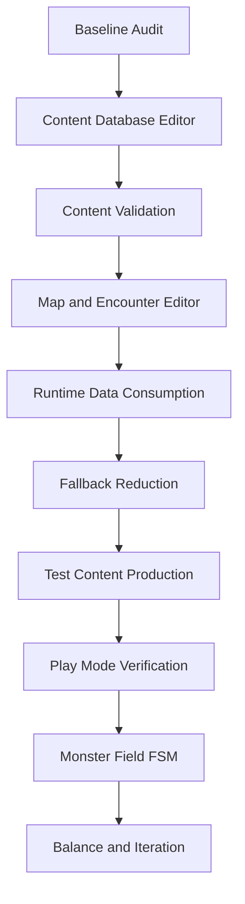
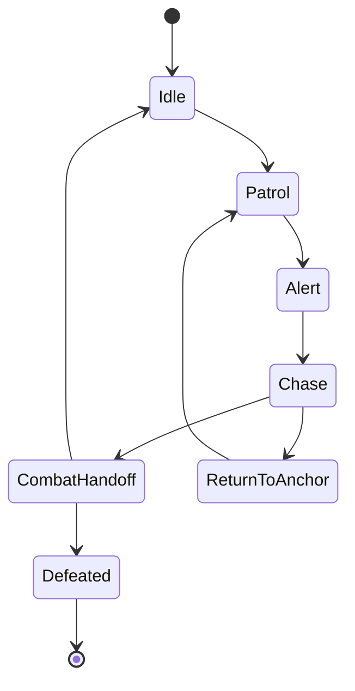

# Editor Tool and Content Production Pipeline Plan

This document defines the production pipeline for moving the project from a
hardcoded runtime prototype toward an editor-authored, validated content workflow.

The immediate goal is not to remove every fallback. The goal is to build a reliable
authoring path first, prove it through validation, then reduce fallback catalog usage
only where the database path is already verified.

## Operating Rule

Every implementation task in this area must update the checklist in this document.

Required workflow for every task:

1. Mark the target checklist item as `In Progress` before implementation.
2. Keep the scope small enough that validation can prove the change.
3. Add or update validation for the new contract.
4. Run the relevant batch validation.
5. Mark the checklist item as `Done` only after validation passes.
6. If work is intentionally deferred, add a short note under `Deferred Notes`.

Status labels:

- `[ ]` Not started
- `[~]` In progress
- `[x]` Done
- `[!]` Blocked or needs design decision

## Pipeline Overview



## Core Principles

- Runtime reads `ContentDatabase.asset` and `CompiledMapAsset` first.
- C# catalog fallback remains until the database route is validated.
- Editor tools must support authoring, saving, validation, and runtime verification.
- Editor-only code must stay out of Runtime/Core assemblies.
- Runtime/Core/UI Runtime must not reference `UnityEditor`, `EditorWindow`, `AssetDatabase`, `MenuItem`, or `Conn.Editor`.
- Test content should be produced only after the relevant editor and validation path exists.
- Monster field AI/FSM should come after map, encounter, and placement contracts are stable.

## Phase 0: Baseline Audit

Purpose: make the current state explicit before expanding tools.

Deliverables:

- Runtime database consumption table
- fallback catalog inventory
- hardcoded scene/NPC/service path inventory
- current validation entry points

Checklist:

- [ ] Create `doc/dev/data_pipeline_status.md`.
- [ ] List all Runtime DB-first paths.
- [ ] List all remaining C# catalog fallback paths.
- [ ] List hardcoded scene generation paths in `P0SceneBuilder`.
- [ ] List hardcoded NPC/service interaction paths.
- [ ] Confirm Chapter 1 batch validation passes.
- [ ] Confirm Chapter 2 batch validation passes.
- [ ] Confirm Runtime/Core/UI Runtime forbidden Editor reference scan passes.

Completion gate:

- The team can answer which systems are DB-authored, fallback-backed, or still hardcoded.

## Phase 1: Content Database Editor

Purpose: make core game content editable inside Unity.

Editor target:

```text
Content Database Window
├─ Asset Selector / Create Database
├─ Quest Tab
├─ Monster Tab
├─ Encounter Tab
├─ NPC Tab
├─ Skill Tab
├─ Vendor Tab
└─ Validation Tab
```

### 1.1 Shared Editor Shell

Checklist:

- [ ] Add stable tab navigation to `ContentDatabaseWindow`.
- [ ] Add active `ContentDatabaseDefinition` selector.
- [ ] Add create/save controls.
- [ ] Add dirty-state handling.
- [ ] Add validation run button.
- [ ] Add validation result panel with errors and warnings.
- [ ] Ensure Editor code stays inside `Conn.Editor`.

Completion gate:

- A designer can select a database asset, edit data, save, and see validation results.

### 1.2 Monster Editor

Fields:

- `Id`
- `DisplayName`
- `MaxHp`
- `AttackPower`
- `Defense`
- `XpReward`
- `Boss`
- `Ai`

Checklist:

- [ ] Add monster list view.
- [ ] Add monster detail editor.
- [ ] Add create/delete monster.
- [ ] Validate id uniqueness.
- [ ] Validate positive HP.
- [ ] Validate positive attack power.
- [ ] Validate non-negative XP reward.
- [ ] Confirm RuntimeContentDatabase can read editor-authored monsters.

Completion gate:

- A new monster created in the editor can be used by an encounter and loaded by Runtime.

### 1.3 Encounter Editor

Fields:

- `Id`
- `DisplayName`
- `MonsterId`
- `Pattern`
- `EnemySlots`
- `XpReward`
- `RewardId`
- future `RewardTableId`

Checklist:

- [ ] Add encounter list view.
- [ ] Add encounter detail editor.
- [ ] Add primary monster selector.
- [ ] Add enemy slot list editor.
- [ ] Add slot id/count/primary controls.
- [ ] Validate primary monster exists.
- [ ] Validate enemy slot monster references.
- [ ] Validate duplicate slot ids.
- [ ] Validate pattern is not empty.
- [ ] Confirm CombatRuntimeService preserves pattern/reward/slots.

Completion gate:

- A new DB-authored encounter can be selected by a quest and starts combat through Runtime.

### 1.4 Quest Editor

Fields:

- `Id`
- `DisplayName`
- `Description`
- `TargetMonsterId`
- `TargetEncounterId`
- `MapKind`
- `MapProfileId`
- `GoldReward`
- `XpReward`
- `RewardItems`

Checklist:

- [ ] Add quest list view.
- [ ] Add quest detail editor.
- [ ] Add target monster selector.
- [ ] Add target encounter selector.
- [ ] Add map profile id field.
- [ ] Add reward item list editor.
- [ ] Validate quest target monster exists.
- [ ] Validate quest target encounter exists.
- [ ] Validate quest target monster matches encounter primary monster.
- [ ] Validate map profile id is present.
- [ ] Confirm Quest Board uses editor-authored quest.

Completion gate:

- A new DB-authored quest appears on the quest board and links to combat.

### 1.5 NPC Editor

Fields:

- `Id`
- `DisplayName`
- `Description`
- `ServiceType`
- `VendorId`
- `QuestIds`

Checklist:

- [ ] Add NPC list view.
- [ ] Add NPC detail editor.
- [ ] Add service type field or selector.
- [ ] Add vendor selector.
- [ ] Add quest/quest seed list editor.
- [ ] Validate vendor reference.
- [ ] Treat `quest_seed_` ids as NPC seed namespace.
- [ ] Warn on unknown non-seed quest ids.
- [ ] Confirm Runtime town service lookup can consume NPC/vendor data.

Completion gate:

- NPC definitions can drive service/vendor/quest seed references without hardcoding every link.

### 1.6 Skill Editor

Fields:

- `Id`
- `DisplayName`
- `EffectKind`
- `TargetMode`
- `Formula`
- `BuyPrice`
- `SellPrice`
- `Power`
- `CatalogIds`

Checklist:

- [ ] Add skill list view.
- [ ] Add skill detail editor.
- [ ] Add effect kind selector.
- [ ] Add target mode selector or field.
- [ ] Add formula field.
- [ ] Add catalog id list editor.
- [ ] Validate non-negative prices.
- [ ] Validate effect kind is runtime-supported or explicitly reserved.
- [ ] Confirm Skill Shop can sell editor-authored skill stock.

Completion gate:

- A new DB-authored skill can appear in vendor stock and be equipped to a dice face.

### 1.7 Vendor Editor

Fields:

- `Id`
- `ServiceType`
- `GoldCost`
- `Summary`
- `StockItemIds`
- `StockSkillIds`
- `CatalogIds`
- `Rotations`

Checklist:

- [ ] Add vendor list view.
- [ ] Add vendor detail editor.
- [ ] Add stock item selector.
- [ ] Add stock skill selector.
- [ ] Add catalog id list editor.
- [ ] Add rotation editor.
- [ ] Validate stock item references.
- [ ] Validate stock skill references.
- [ ] Validate rotation conditions.
- [ ] Confirm Blacksmith/Skill Merchant/Apothecary can consume editor-authored vendor data.

Completion gate:

- Vendor stock and rotation can be authored and used by Runtime shops.

## Phase 2: Validation System

Purpose: prove editor-authored content cannot break Runtime contracts.

Checklist:

- [ ] Add shared validation result UI to Content Database Window.
- [ ] Add quest -> encounter -> monster validation.
- [ ] Add quest -> map profile validation.
- [ ] Add encounter enemy slot validation.
- [ ] Add NPC vendor/service/quest seed validation.
- [ ] Add skill effect/target/formula validation.
- [ ] Add vendor stock/rotation validation.
- [ ] Add generated equipment contract validation.
- [ ] Add reward item validation.
- [ ] Run the same validation in Chapter 1 and Chapter 2 batch validators where relevant.

Completion gate:

- Invalid content is caught in the editor before Play Mode.

## Phase 3: Map and Encounter Editor

Purpose: author and validate dungeon generation outputs.

Tool target:

```text
Generator Workbench
├─ Map Profile Selection
├─ Seed Input
├─ Generate Draft
├─ Room Graph Summary
├─ Placement List
├─ Validation Result
└─ Save CompiledMapAsset
```

Checklist:

- [ ] Add map profile selection.
- [ ] Add seed input and regenerate action.
- [ ] Show room graph node list.
- [ ] Show critical path and side branch summary.
- [ ] Show placement list.
- [ ] Show start placement.
- [ ] Show quest target placement.
- [ ] Show boss placement.
- [ ] Show exit placement.
- [ ] Show monster placements.
- [ ] Show loot placements.
- [ ] Show validation errors/warnings.
- [ ] Save/export `CompiledMapAsset`.
- [ ] Validate saved compiledMap can be loaded by Runtime.

Completion gate:

- A compiled map can be generated, inspected, validated, saved, and consumed by Runtime.

## Phase 4: Runtime Data Consumption

Purpose: make editor-authored data actually drive the game loop.

Checklist:

- [ ] Quest Board uses DB quest candidates first.
- [ ] Quest Board reroll policy supports DB candidates.
- [ ] Combat resolves DB encounter first.
- [ ] Combat preserves pattern/reward/slots.
- [ ] Shops resolve DB vendor stock first.
- [ ] Skill Merchant refresh uses DB/candidate catalogs.
- [ ] Apothecary stock can come from DB vendor/item definitions.
- [ ] Town NPC service/vendor/quest data is consumed directly where possible.
- [ ] Dungeon uses saved compiledMap asset before generator fallback.
- [ ] Field monsters are registered from compiledMap placements.
- [ ] Fallback usage is tracked or documented.

Completion gate:

- The default test loop can run from database and compiledMap assets.

## Phase 5: Fallback Reduction

Purpose: shrink C# catalog usage only after the DB route is verified.

Checklist:

- [ ] Mark fallback paths as required, debug-only, or removable.
- [ ] Replace one verified fallback path at a time.
- [ ] Add validation before removing each fallback.
- [ ] Keep emergency fallback for batch validation until replacement is proven.
- [ ] Document every removed fallback in `remaining_work.md`.

Completion gate:

- Runtime behavior no longer depends on hardcoded data for verified content categories.

## Phase 6: Test Content Production

Purpose: prove the tools work for real production, not only sample data.

Minimum test content target:

```text
Quests: 5
Monsters: 8
Encounters: 6
NPCs: 8
Skills: 12
Vendors: 4
Map Profiles: 2
Compiled Maps: 2
Reward IDs / Tables: 5
```

Checklist:

- [ ] Author 8 monsters through the editor.
- [ ] Author 12 skills through the editor.
- [ ] Author 6 encounters through the editor.
- [ ] Author 5 quests through the editor.
- [ ] Author 4 vendors through the editor.
- [ ] Author or verify 8 NPC definitions.
- [ ] Generate 2 compiled maps.
- [ ] Link quests to encounters and map profiles.
- [ ] Validate all content.
- [ ] Play through at least 3 quests in sequence.

Completion gate:

- Test content can be produced without touching C# catalogs.

## Phase 7: Monster Field FSM

Purpose: make dungeon monsters active field actors instead of static contact markers.

Proposed FSM:



Proposed data contract:

```text
MonsterFieldAiProfile
├─ monsterId
├─ encounterId
├─ behaviorKind
├─ patrolRadius
├─ aggroRadius
├─ loseAggroDistance
├─ moveSpeed
├─ chaseSpeed
├─ returnSpeed
└─ contactCooldown
```

Checklist:

- [ ] Add field monster AI profile data contract.
- [ ] Add validator for field AI profile references.
- [ ] Spawn field monster actors from compiledMap monster placements.
- [ ] Store anchor position per actor.
- [ ] Implement Idle.
- [ ] Implement Patrol or Wander.
- [ ] Implement player detection.
- [ ] Implement Chase.
- [ ] Implement ReturnToAnchor.
- [ ] Implement contact cooldown.
- [ ] Preserve combat handoff state.
- [ ] Restore state correctly after Flee.
- [ ] Mark defeated after Victory.
- [ ] Prevent duplicate contact triggers.

Completion gate:

- A monster moves in the dungeon, detects the player, starts combat once, and resolves correctly after flee/victory.

## Phase 8: Play Mode Verification

Purpose: verify the full authored pipeline in the actual Game view.

Checklist:

- [ ] New Game starts from Title.
- [ ] DB quest appears on Quest Board.
- [ ] Quest acceptance sets target encounter and map profile.
- [ ] Gate enters the correct dungeon.
- [ ] compiledMap start/exit/monster placement is used.
- [ ] Monster contact starts DB encounter combat.
- [ ] Combat victory grants encounter reward.
- [ ] Quest return grants quest reward.
- [ ] Board rerolls after quest completion.
- [ ] Ending/Continue policy still works.
- [ ] uGUI HUD remains readable in Game view.
- [ ] Save/load preserves relevant state.

Completion gate:

- The authored content pipeline supports repeated manual playtests.

## Current Recommended Next Step

Start with Phase 1.1 through Phase 1.4:

1. Content Database Window shell
2. Monster Editor
3. Encounter Editor
4. Quest Editor

Do not start Monster Field FSM until these are complete and validated.

## Deferred Notes

Add notes here when a checklist item is intentionally postponed.

- No deferred items yet.
