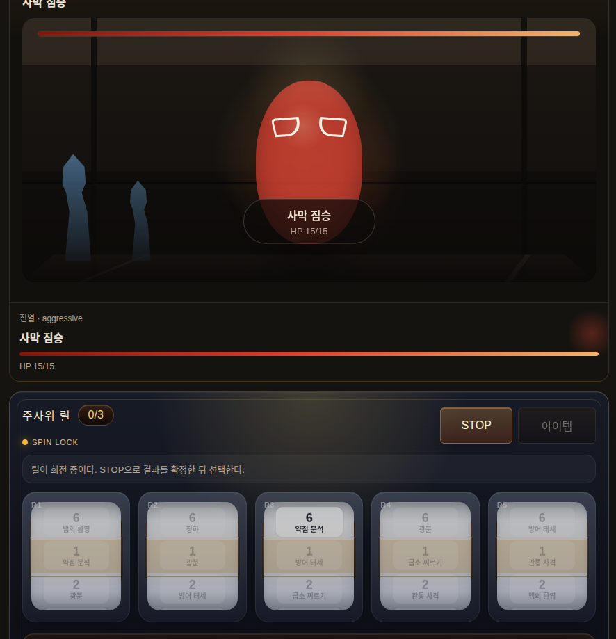

# 레거시 전투 시스템

이 문서는 과거 웹게임의 전투 기본 로직을 Unity 재개발 참고용으로 정리한다.
JavaScript 코드를 그대로 포팅하지 않고, 같은 규칙을 Unity C# 도메인 모델과
UI로 다시 구현한다.

참고 스크린샷:

## 참조 소스 위치

레거시 웹게임 소스는 [`webgame_ref/src/`](webgame_ref/src/)에 있다. 전투 구현을
볼 때 우선 확인할 파일은 다음이다.

- [`webgame_ref/src/combatRuntime.js`](webgame_ref/src/combatRuntime.js): 전투 시작,
  턴 진행, 적 행동, 도주, 아이템, 승리/패배 처리
- [`webgame_ref/src/diceCombatRuntime.js`](webgame_ref/src/diceCombatRuntime.js):
  주사위 릴, STOP, 선택 제한, 쿨다운, 효과 해석
- [`webgame_ref/src/renderCombat.js`](webgame_ref/src/renderCombat.js): 전투 화면과
  릴 UI 표시
- [`webgame_ref/src/renderGame.js`](webgame_ref/src/renderGame.js): 전투 버튼 이벤트
  연결
- [`webgame_ref/src/combatScene3d.js`](webgame_ref/src/combatScene3d.js): 전투 장면
  3D 표현 참고
- [`webgame_ref/src/data/encounters.json`](webgame_ref/src/data/encounters.json):
  조우 데이터
- [`webgame_ref/src/data/monsters.json`](webgame_ref/src/data/monsters.json):
  몬스터 데이터
- [`webgame_ref/src/data/skills.json`](webgame_ref/src/data/skills.json): 스킬 데이터
- [`webgame_ref/src/data/items.json`](webgame_ref/src/data/items.json): 아이템 데이터
- [`webgame_ref/src/data/loot_tables.json`](webgame_ref/src/data/loot_tables.json):
  전리품 데이터

## 전투 진입

전투는 별도 씬/상태 머신이다. 던전에서 직접 싸우는 방식이 아니라
`Dungeon -> Combat -> Dungeon` 흐름으로 처리한다. 전투는 던전의 encounter
placement에서 시작된다. 레거시 구현에서는
`combatRuntime.js`의 `startCombat()`이 조우 ID를 읽고, encounter 데이터와 monster
데이터를 조합해 적 목록을 만든다.

전투가 시작되면 다음 상태가 생성된다.

- placement ID
- encounter ID와 이름
- 현재 층
- 적 목록
- 라운드 번호
- 행동한 영웅 ID 목록
- 전투 아이템 선택 상태
- 주사위 상태
- 전투 로그

Unity에서는 이 구조를 `CombatSession`, `Combatant`, `EncounterDefinition` 같은
C# 모델로 다시 설계한다.

## 턴 구조

전투는 별도 인스턴스에서 진행되는 턴제 전투다.

1. 전투 진입 시 현재 조우의 적 목록을 만든다.
2. 살아 있는 영웅 중 이번 턴에 행동할 영웅을 고른다.
3. 영웅 턴 시작 시 주사위 릴을 생성하고 `spinning` 상태로 둔다.
4. 플레이어가 STOP을 누르면 릴이 멈춘다.
5. 모든 릴이 멈추면 선택 단계로 넘어간다.
6. 플레이어는 제한 개수만큼 주사위 결과를 선택한다.
7. 선택한 결과를 대상에게 적용한다.
8. 살아 있는 다음 영웅이 있으면 다음 영웅 턴으로 넘어간다.
9. 모든 영웅이 행동하면 적 턴을 처리한다.
10. 라운드를 증가시키고 다음 라운드로 넘어간다.

## 주사위/릴 기본 규칙

레거시 기본값은 다음과 같다.

- 기본 주사위 수: 5
- 기본 선택 제한: 3
- 각 주사위는 6개 면을 가진다.
- 각 면은 숫자 값과 스킬 ID를 가진다.
- 비어 있는 면은 기본 공격으로 해석한다.
- `signature` 면은 영웅의 대표 스킬로 치환한다.
- 쿨다운은 스킬 전체가 아니라 주사위 슬롯 단위로 적용된다.

관련 레거시 함수:

- `createDiceCombatRuntime()`
- `normalizeHeroLoadout()`
- `beginHeroTurn()`
- `stopNextRoll()`
- `stopAllRolls()`
- `toggleRollSelection()`
- `resolveSelectedRolls()`

## 선택과 해석

릴이 모두 멈추면 전투 상태는 `select` 단계가 된다. 플레이어는 멈춘 결과 중
선택 제한만큼 고른다.

선택 결과는 순서가 기록된다. 선택된 각 주사위는 다음 정보를 가진다.

- 주사위 ID
- 면 인덱스
- 숫자 값
- 스킬 ID
- 스킬 이름
- 효과 종류
- 대상 모드
- 공식
- 쿨다운 키

Unity에서는 이 데이터를 `DiceRollResult`, `DiceFaceDefinition`,
`ResolvedCombatAction` 같은 타입으로 분리하는 것이 좋다.

## 효과 종류

레거시 전투는 선택된 주사위 면을 다음 효과로 해석한다.

- `attack`: 적에게 피해
- `skill`: 대표 공격 스킬
- `heal`: 아군 회복
- `defend` / `guard`: 방어와 가드 수치 부여
- `buff`: 아군에게 시간제 강화 부여
- `debuff`: 적에게 시간제 약화 부여
- `support`: 적의 약점 노출 증가
- `lifesteal`: 피해 후 일부 회복
- `summon`: 데이터는 있으나 실제 소환수 로직은 보류

## 공식

레거시 공식은 주사위 값과 스킬 효과값을 조합한다.

- `die_as_effect`: 주사위 값 그대로
- `die_plus_effect`: 주사위 값 + 효과값
- `die_minus_effect`: 주사위 값 - 효과값
- `die_times_effect`: 주사위 값 x 효과값
- `die_divide_effect`: 주사위 값 / 효과값
- `die_equals_effect`: 고정 효과값

Unity에서는 이 공식을 enum과 evaluator로 분리한다.

## 피해 계산

공격 계열은 대략 다음 요소를 조합한다.

- 주사위 공식 결과
- 영웅 공격력
- 대표 스킬 보정
- 영웅 강화 효과
- 적 약화 효과
- 적 방어력
- 적 약점 노출
- 소량의 랜덤 보정

레거시 구현은 최소 1 피해를 보장한다. Unity에서도 초반 구현은 같은 규칙을
유지하고, 밸런싱 단계에서 방어/저항/치명타 등을 확장한다.

## 적 턴

모든 영웅이 행동하면 살아 있는 적이 순서대로 행동한다. 적은 살아 있는 파티원 중
하나를 골라 공격한다.

적 행동에는 다음 규칙이 있다.

- 기절 상태면 행동하지 못하고 기절 턴을 줄인다.
- 약화 효과가 있으면 공격 피해가 줄어든다.
- 대상이 방어 태세면 피해를 절반으로 줄인다.
- 대상에게 guard가 있으면 guard가 먼저 피해를 흡수한다.
- 파티 전원이 쓰러지면 패배 처리로 넘어간다.

## 승리와 보상

모든 적이 쓰러지면 승리 처리로 넘어간다.

승리 시 반영할 항목은 다음이다.

- 적 XP 합산
- 살아 있는 파티원에게 XP 지급
- 보스 처치 플래그 갱신
- 퀘스트 조건 갱신
- encounter placement 완료 처리
- 필드 몬스터 상태 제거
- 전리품 테이블 기반 보상 지급
- 던전 모드로 복귀

Unity에서는 이 처리를 `CombatRewardResolver`, `QuestProgressService`,
`WorldStateService`와 분리해서 구현하는 것이 좋다.

## 패배와 도주

파티가 전멸하면 전투 세션을 종료하고 패배 흐름으로 넘어간다. 레거시에서는 사망
엔딩과 타이틀 복귀로 처리했다.

도주는 보스가 있으면 막히며, 일반 조우에서는 확률 판정을 사용한다. 성공하면 조우
직전 스냅샷으로 되돌리고 던전 모드로 복귀한다.

Unity에서는 도주 성공 시 위치, 파티 상태, 인벤토리, 퀘스트, 필드 몬스터 상태를
어디까지 되돌릴지 별도 정책으로 정해야 한다.

## Unity 구현 방향

레거시 로직을 기준으로 초기 C# 구조는 다음처럼 나눈다.

- `CombatSession`: 현재 전투 상태
- `Combatant`: 영웅/적 공통 전투 개체
- `EncounterDefinition`: 조우 정의
- `DiceLoadout`: 영웅의 주사위 구성
- `DiceFaceDefinition`: 주사위 면 정의
- `DiceRollResult`: 이번 턴에 나온 주사위 결과
- `DiceCombatService`: 릴 생성, STOP, 선택, 쿨다운 처리
- `CombatResolver`: 선택 결과를 피해/회복/버프/디버프로 해석
- `EnemyTurnResolver`: 적 턴 처리
- `CombatRewardResolver`: 승리 보상 처리
- `CombatHudController`: 전투 UI와 입력 연결

초기 목표는 레거시의 모든 예외를 복제하는 것이 아니라, 다음 흐름을 먼저 닫는
것이다.

1. 조우 시작
2. 영웅 주사위 5개 생성
3. STOP으로 릴 정지
4. 최대 3개 선택
5. 선택 결과로 적에게 피해
6. 적 턴 반격
7. 승리 시 XP와 전리품 지급
8. 던전으로 복귀
